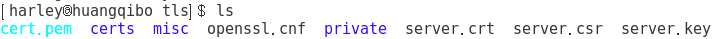

*如果没有httpd,按下面步骤安装:*

**安装httpd服务**

```
yum install httpd -y
```

**重启httpd服务**

```
systemctl start httpd.service
```

**关闭系统防火墙**　　

```
systemctl stop iptables.service
```

**httpd服务安装完成**


**1.查看是否安装httpd和SSL（如果有就可以进行下一步）**

[harley@harley ~]$ rpm -qa | grep httpd
httpd-tools-2.4.6-80.el7.centos.1.x86_64
httpd-2.4.6-80.el7.centos.1.x86_64

[harley@harley ~]$ rpm -qa | grep ssl
openssl-1.0.2k-12.el7.x86_64
python-backports-ssl_match_hostname-3.5.0.1-1.el7.noarch
openssl098e-0.9.8e-29.el7.centos.3.x86_64
xmlsec1-openssl-1.2.20-7.el7_4.x86_64
openssl-libs-1.0.2k-12.el7.x86_64


**2.生成服务器私钥**

[harley@harley ~]$ cd  /etc/pki/tls

[harley@harley tls]$ sudo openssl genrsa -out server.key 1024
[sudo] harley 的密码：
Generating RSA private key, 1024 bit long modulus
...++++++
...............................................................................++++++
e is 65537 (0x10001)


**3.用私钥server.key文件生成证书请求文件csr** 

[harley@harley tls]$ sudo openssl req -new -key server.key -out server.csr

Country Name (2 letter code) [XX]:China
string is too long, it needs to be less than  2 bytes long
Country Name (2 letter code) [XX]:CN
State or Province Name (full name) []:sichuan
Locality Name (eg, city) [Default City]:chengdu
Organization Name (eg, company) [Default Company Ltd]:UESTC
Organizational Unit Name (eg, section) []:UESTCXX
Common Name (eg, your name or your server's hostname) []:icreidea.com    
Email Address []:1290355757@qq.com

上面的步骤完成之后会让你输入一个密码：
A challenge password []:
An optional company name []:
不用理,直接回车


**4.生成证书文件**

[harley@harley tls]$ sudo openssl x509 -days 365 -req -in server.csr -signkey server.key -out server.crt

结果如下:
Signature ok
subject=/C=CN/ST=sichuan/L=chengdu/O=UESTC/OU=UESTCXX/CN=icreidea.com/emailAddress=1290355757@qq.com
Getting Private key



